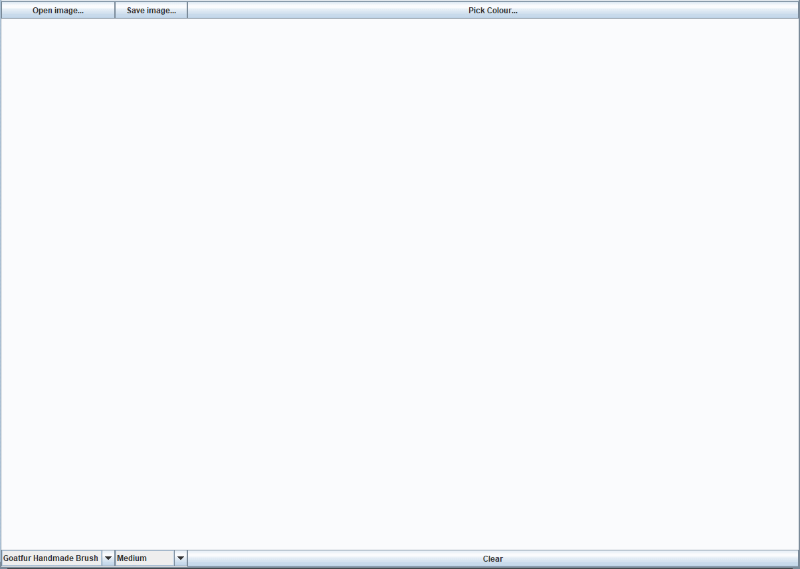
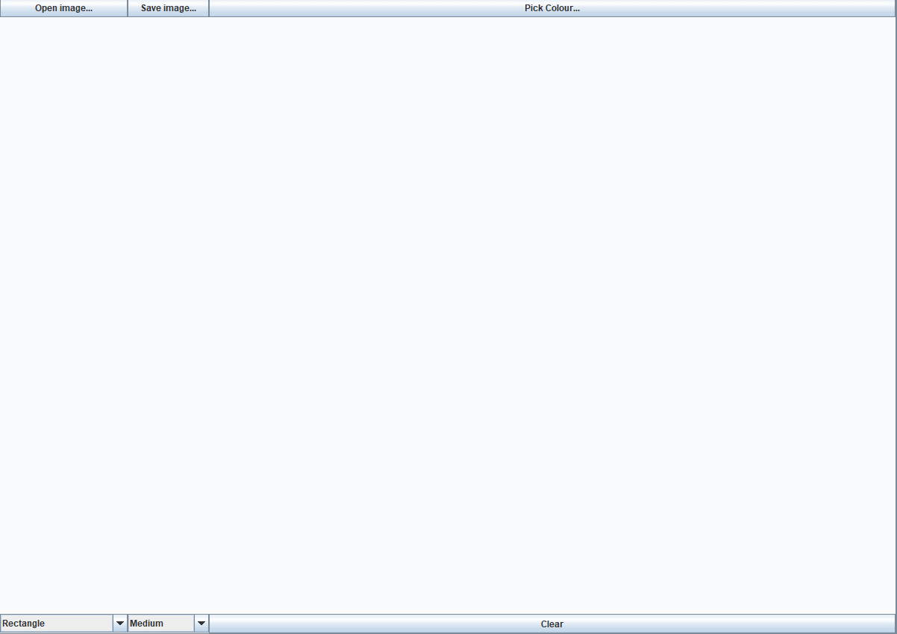

# painting-project

"painting-project" contains the source code and previews of an application I made using Java. I used several language constructs and methods, including the Swing GUI, Buffered Images, and related libraries liberally. I believe this best shows my resourcefulness in this language.

Basic brush usage just like your Windows XP paint!

Complete with colour changing, fill and shapes tools!

Save and open any files you have created!

